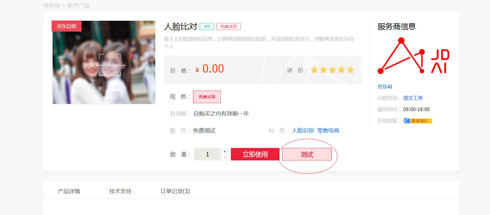
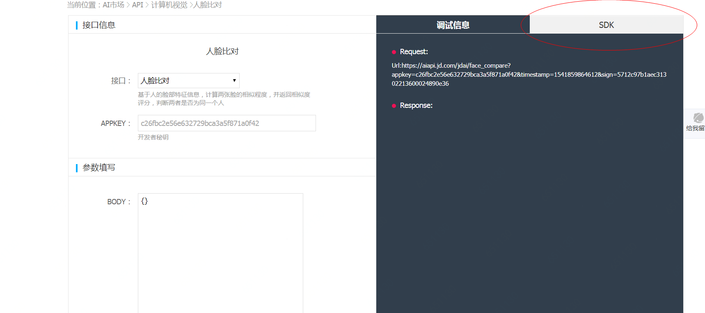

# 鉴权认证
## 一、	名词介绍
- 1、	secretKey：完成NeuHub平台的用户认证后，在[买家中心](https://neuhub.jd.com/user/baseInfo)中可进行查看，作为重要的调用凭证请注意保密，如有泄露请第一时间联系NeuHub平台在线客服/提交工单，我们将为您进行替换。

- 2、	timestamp：13位时间戳，自1970年1月1日0时起的毫秒数，为了防止用户时钟与服务器时钟不同步而导致的认证失败，此处引入5分钟的宽松系数。如果服务器收到请求的时间不符合以上时间要求，则认为请求超时，拒绝该请求；如果符合上述要求，则执行下一步操作。

- 3、sign: 签名，计算规则详见下方计算步骤规则

## 二、通过NeuHub提供的sdk计算sign

- 1、通过`secretkey`和`timestamp`计算sign的sdk

可在以下链接下载，我们提供java与python两种语言的sdk供您选用

    Java SDK：http://jdai.oss.cn-north-1.jcloudcs.com/aisdk/sdk-java.zip

    Python SDK：http://jdai.oss.cn-north-1.jcloudcs.com/aisdk/sdk-python.zip

- 2、查看每个API使用sdk调用的示例代码（示例代码仅作参考，请根据实际情况做相应调整）

下载sdk后，您可以在每个api的商品详情页，点击进入测试页面，查看使用sdk调用接口的示例代码




## 三、sign计算步骤详解
- 1、把`secretkey`和`timestamp`参数值进行拼装
例如：

字段 | 参数
---|---
secretkey | 2e148773a0338a8f2200ba90d445f084
timestamp | 1541491668060

拼装结果为：
`
2e148773a0337a8f2200ba90d445f0841541491668060
`

- 2、使用MD5对拼装完的字符串进行加密，获取`sign`

```
import com.google.common.hash.Hashing;

String secretKey = "2e148773a0338a8f2200ba90d445f084";
long timestamp = System.currentTimeMillis();
String sign = Hashing.md5().hashString(secretKey + timestamp, Charset.forName("UTF-8")).toString();
```

