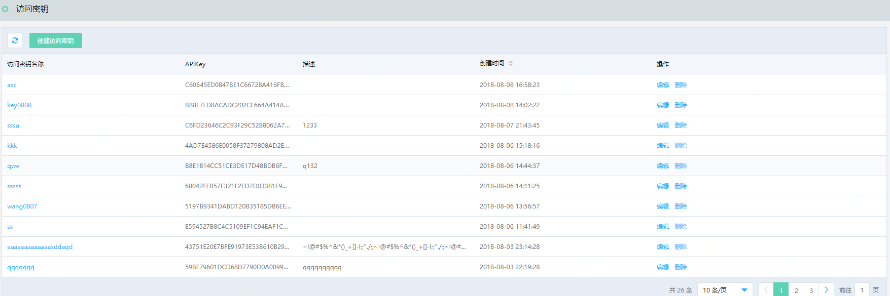
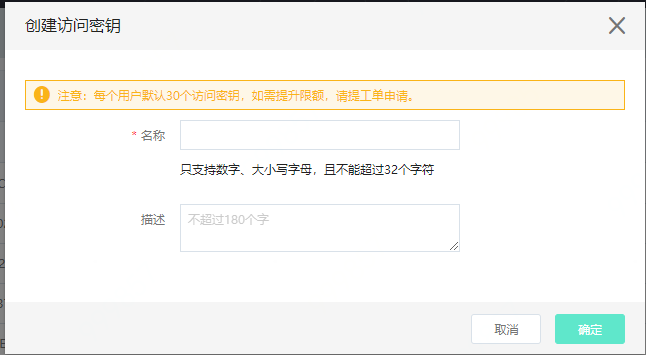
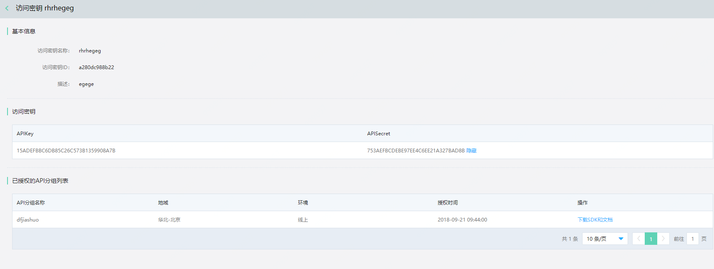
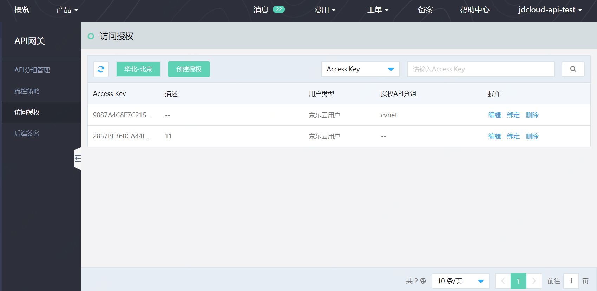
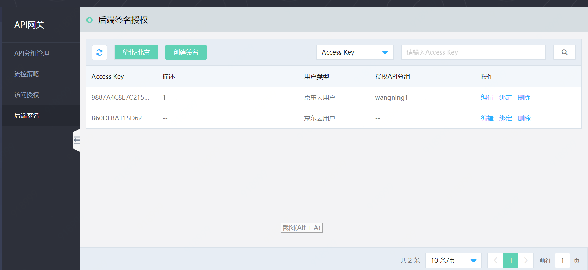
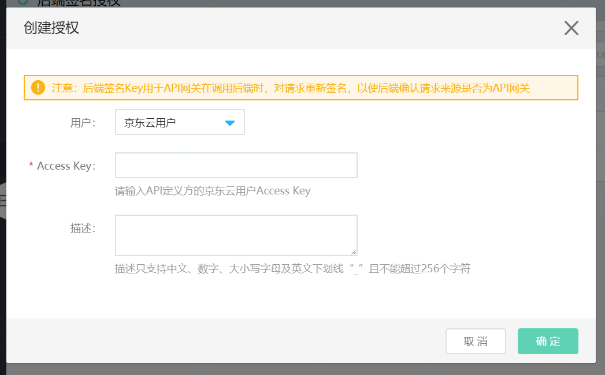
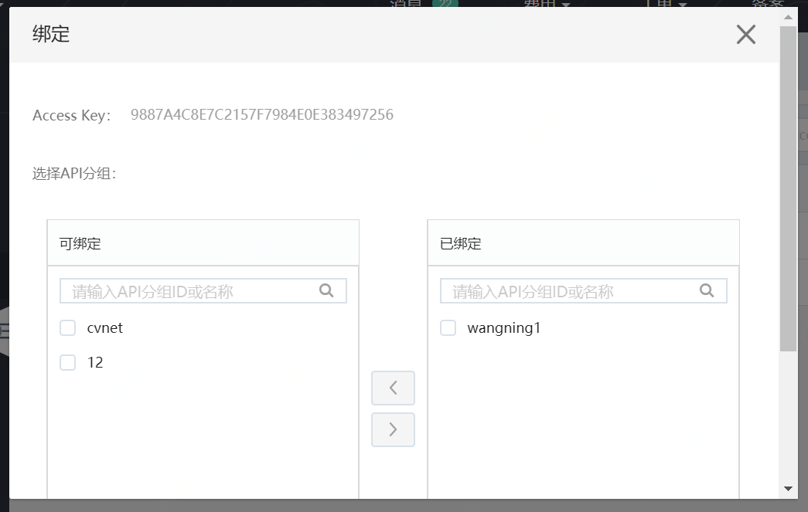

 # **API的访问授权**

API的访问授权过程，即API提供方给API调用方授权应用的过程。授权过程分为两部分：

- API调用方创建和提供 **访问密钥** 。访问密钥（APIKey/APISecret）代表请求者的身份。

- API提供方授权API分组给API调用方使用。

当API提供方的客户或者自己需要测试调用 API 时，都需要创建 访问密钥 作为请求者的身份，然后由API提供方在访问授权中，授权API分组给 API调用者使用。
## **操作步骤**
**API调用者创建和提供 访问密钥**

**STEP1: 点击左侧菜单 访问密钥 进入访问密钥列表页**

**STEP2: 点击 创建访问密钥**

- 密钥创建成功后，系统会自动生成访问密钥ID、APIKey、APISecret。

- API调用者需要将 **访问密钥ID** 告知API提供者，由API提供者进行访问授权。

**API提供者授权API分组给API调用者使用**

**STEP1: API提供者获取API调用者的访问密钥ID。**

API调用者可在访问密钥详情页找到访问密钥ID，并将该ID告诉API提供者。

**STEP2: API提供者创建1个授权。**

首先进入左侧菜单的 **访问授权** 列表页

然后点击 **创建授权**，在授权信息中，填入API调用者提供的访问密钥ID。

**STEP3: API提供者绑定授权给API分组**

密钥创建成功后，点击 **绑定**进行授权分组的绑定关系。

## **后端签名**
后端签名密钥采用京东云用户AK/SK(Access Key/Access Key Secret) 在网关请求您的真实后端时，通过后端签名校验保障您后端的安全。

您将京东云用户AK绑定到 API分组 上后，当网关请求这个分组下的 API 时，会添加并出示该AK/SK，您的后端通过验证签名字符串来验证网关的身份。

点击左侧 后端签名，进行后端签名的配置和绑定。

### **操作步骤**
点击左侧 **后端签名**，进行后端签名的配置和绑定

1.进入后端签名列表页

2.新增后端签名

3.给分组绑定签名

